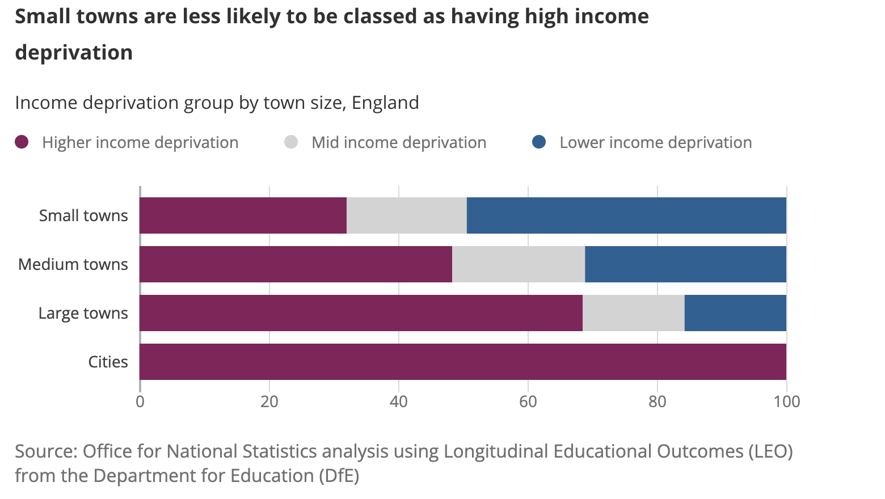

# TidyTuesday 2024 - Week 04

This week were have data from the Educational attainment of young people in English towns. The data comes from the UK Office for National Statistics (). The data was alws discussed estivesly in the article, [Why do children and young people in smaller towns do better academically than those in larger towns?](https://www.ons.gov.uk/peoplepopulationandcommunity/educationandchildcare/articles/whydochildrenandyoungpeopleinsmallertownsdobetteracademicallythanthoseinlargertowns/2023-07-25)

This week I am attempting to recreate the **100% Horizontal Stacked Bar Chart?** used in the article. This type of chart is a great way of displaying data data, allowing you to compare multiple categories. I have often seen it used when representing data from survey scales, where you have multiple sub groups in one larger category.

The article represented the data as follows:

## LIBRARIES
I used the following libraries for this project.

- {tidytuesdayR} -- Access 'TidyTuesday' Weekly Projects

- {tidyverse} --  A collection of open source packages for the R programming language (namely {ggplot2} and {dplyr})

- {showtext} -- Using Fonts More Easily in R Graph

## REFERENCES

1. Hughes E, Harmon J, Mock T, Community ROL. tidytuesdayR: Access the Weekly “TidyTuesday” Project Dataset. Published online December 13, 2023. Accessed February 2, 2024. https://cran.r-project.org/web/packages/tidytuesdayR/index.html
2. Wickham H, RStudio. tidyverse: Easily Install and Load the “Tidyverse.” Published online February 22, 2023. Accessed February 2, 2024. https://cran.r-project.org/web/packages/tidyverse/index.html
3. Qiu Y. showtext. Published online January 20, 2024. Accessed January 21, 2024. https://github.com/yixuan/showtext
4. Office for National Statistics. Why do children and young people in smaller towns do better academically than those in larger towns? - Office for National Statistics. Education and Childcare. Published July 25, 2023. Accessed February 5, 2024. https://www.ons.gov.uk/peoplepopulationandcommunity/educationandchildcare/articles/whydochildrenandyoungpeopleinsmallertownsdobetteracademicallythanthoseinlargertowns/2023-07-25

